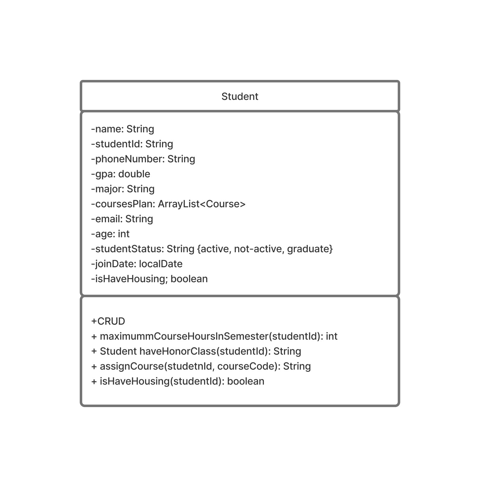

# Learning Management System
A simple Spring Boot-based Learning Management System (LMS) for managing students, instructors, and courses.

## Features

- Manage students, instructors, and courses
- Assign courses to students and instructors
- Search and filter courses
- Update student status and instructor leave
- Validation for all entities

# Technologies Used

- Java 17
- Spring Boot 3
- Spring Web
- Spring Validation
- Lombok

## Project Structure

```
LearningManagementSystem/
├── src/
│   ├── main/
│   │   ├── java/org/example/learningmanagementsystem/
│   │   │   ├── Controller/
│   │   │   ├── Model/
│   │   │   ├── Service/
│   │   │   └── Api/
│   │   └── resources/
│   │       └── application.properties
│   └── test/
├── pom.xml
```
### **API Endpoints:**
- Students: `/api/v1/students`
- Instructors: `/api/v1/instructors`
- Courses: `/api/v1/courses`

<hr>

### Student Model

**postman:**  https://documenter.getpostman.com/view/28194064/2sB34oCHcJ
services:
* **Add Student**: add new student with validation
* **Get All Student**: show you all student in virtual database
* **Update Student By Id**: update exist student by id and validate updated data
* **Delete Student By Id**: delete exist student by id
* **Get Maximum Credit Hours**: show student the maximum hours he can take in semester by id
* **Get Student Is Have Honor Class**: show student if he has honor class or not
* **Assign Course To Student**: this funstion have logic that check maximum student hours and let student know if he can take the course or not
* **Get Student Housing**: show student is he has housing in college or not
<hr>

### Course Model

**postman**: https://documenter.getpostman.com/view/28194064/2sB34oCHXs  
**services**:
* **Add Course**: add new course with validation
* **Get All Course**: show you all course in virtual database
* **Update Course By Id**: update exist course by code and validate updated data
* **Delete Course By Id**: delete exist course by code
* **Search By Keword**: show you all the courses matchs keyword
* **Get All Courses By Department**: show student all courses with specific depratment name
* **Get All Courses Availabe By Semester Number**: show you all courses by specific semester number
* **Get All Courses (Not Elective)**: this will show student what courses he must take and finish it

<hr>

### Instructor

**postman:** https://documenter.getpostman.com/view/28194064/2sB34oCHcG  
**services:**
* **Add Instructor**: add new Instructor with validation
* **Get All Instructor**: show you all Instructor in virtual database
* **Update Instructor By Id**: update exist Instructor by id and validate updated data
* **Delete Instructor By Id**: delete exist Instructor by id
* **Loud Bonus**: have logic that chairman can give all instructors exceeds the load hours bonus
* **Assign Instructor With Courses**: logic that make chairman only can assign courses to instructors
* **Request Leave**: logic that make only chairman can give the leave for requester
* **Change Student Status**: logic make only chairman can change student status